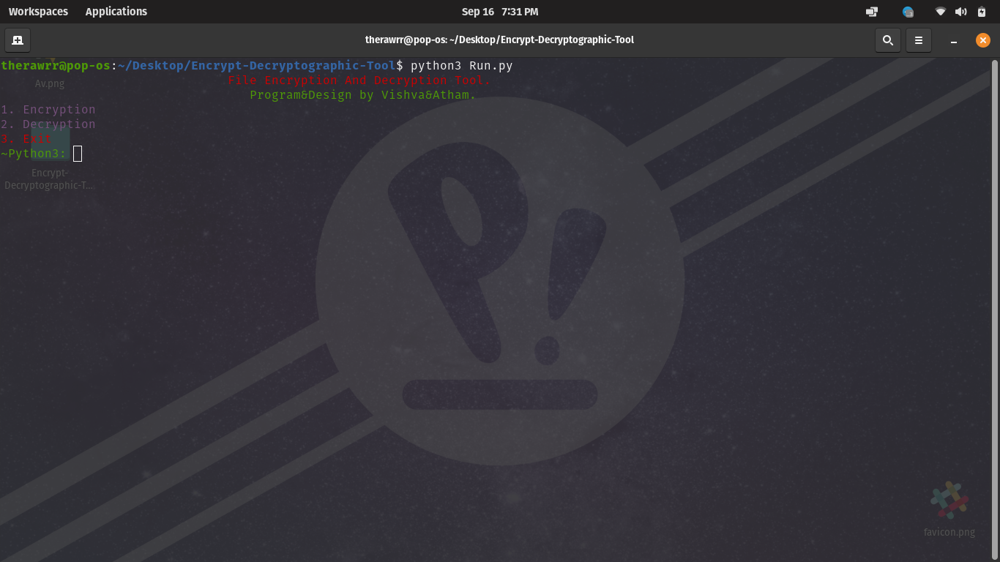

# Secure File Encryption

A Simple Encryption and Decryption Cryptographic tool for encrypting and decrypting our sensitive files. 
Implement strong encryption algorithm such as AES-256. AES Stands for Advanced Encryption Standards. Advanced Encryption Standard(AES) is a symmetric encryption algorithm. Symmetric encryption is very fast as compared to asymmetric encryption and are used in systems such as database system.
This tool can able to encrypt Images/Videos/Audios/Text.
The files that are encrypted using this tool can only able to decrypt other than that it can't able to decrypt other encrypted files.
We can encrypt and decrypt any type of file using this tool.

### Tool Main Window:

### Dependencies:

1. python v3.x is required.
2. termcolor module is required.
3. tqdm module is also required.

### How to use:
1. Fork the repository & Clone it into your local system by: git clone https://github.com/theRawrrr/Secure-File-Encryption.git
2. Get into your Directory "/Secure-File-Encryption"
3. Run the tool by this command: python3 Run.py
4. Select your desired option and provide filename with extension.
5. Note: Move your respective files that need to be encrypted/decrypted to the Secure-File-Encryption directory before following the step 4. Example: (OriginalAudio.flac, OriginalImg.png, OriginalTxt) all are the files i included in this repo can be used for the encryption. Likewise, You can use your own files as well.

